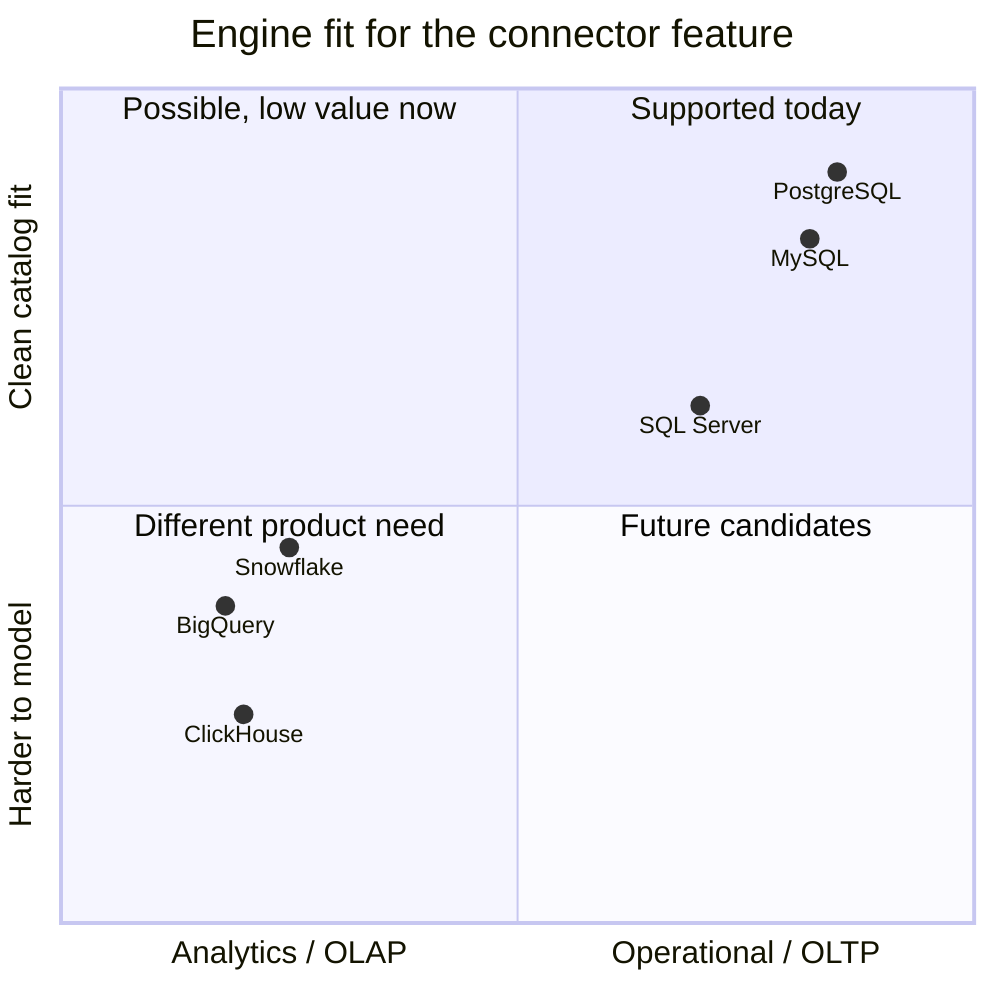
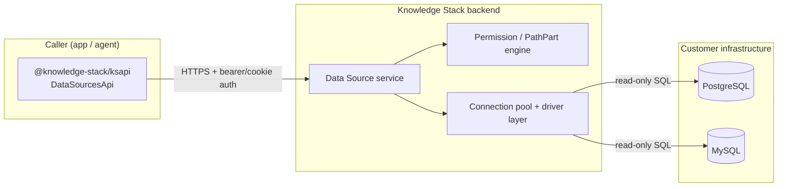
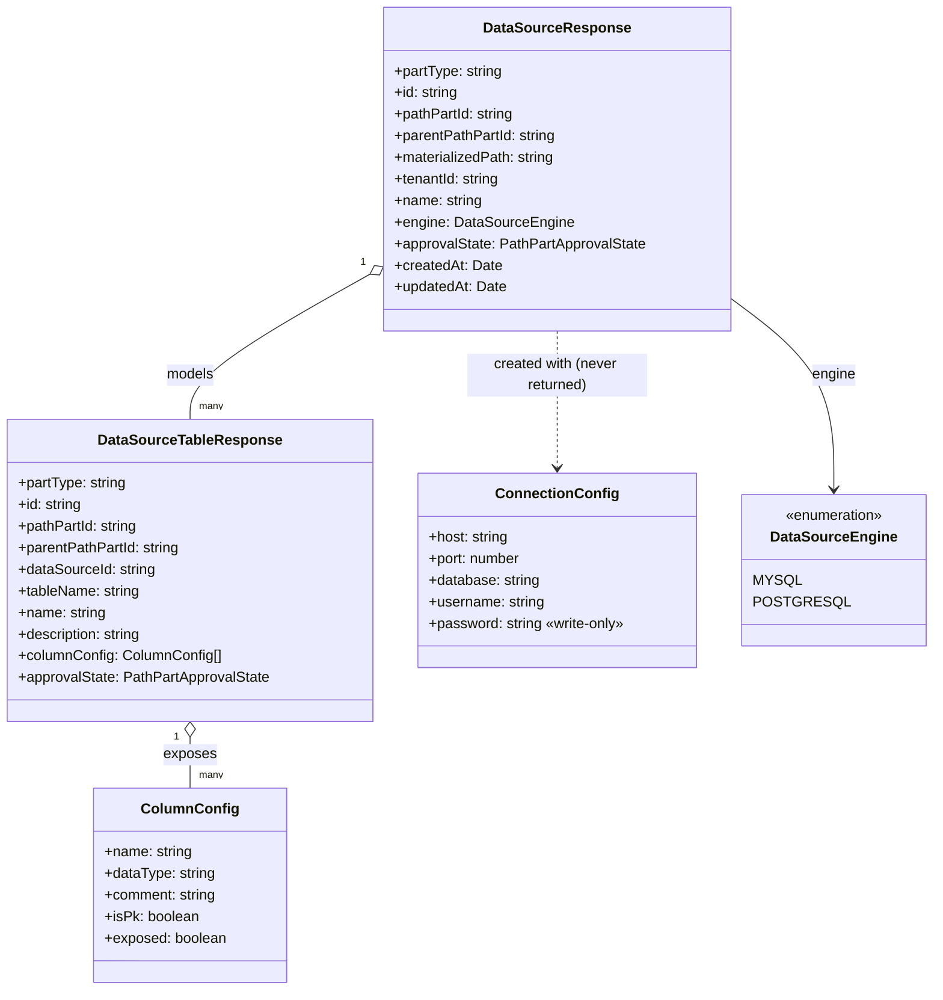
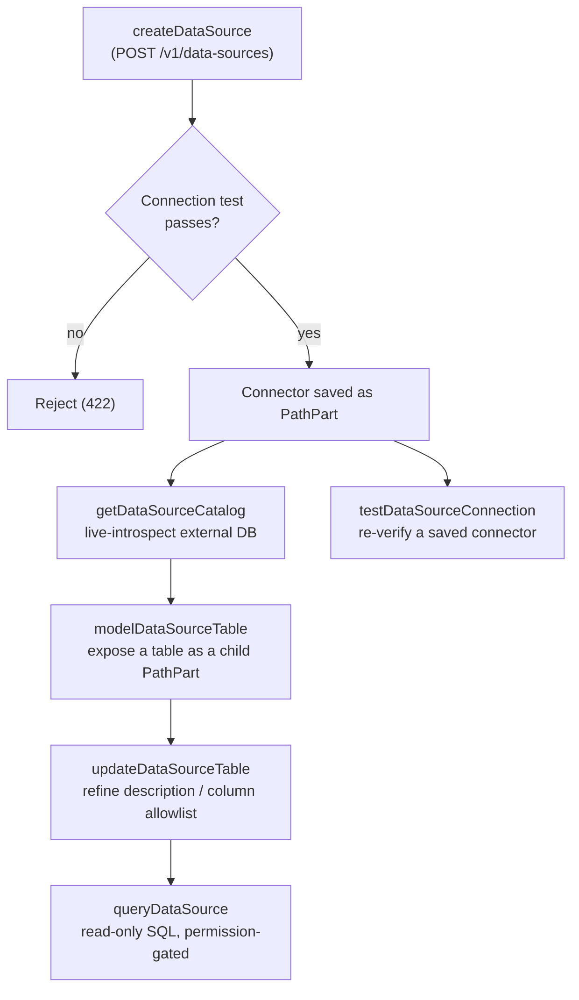
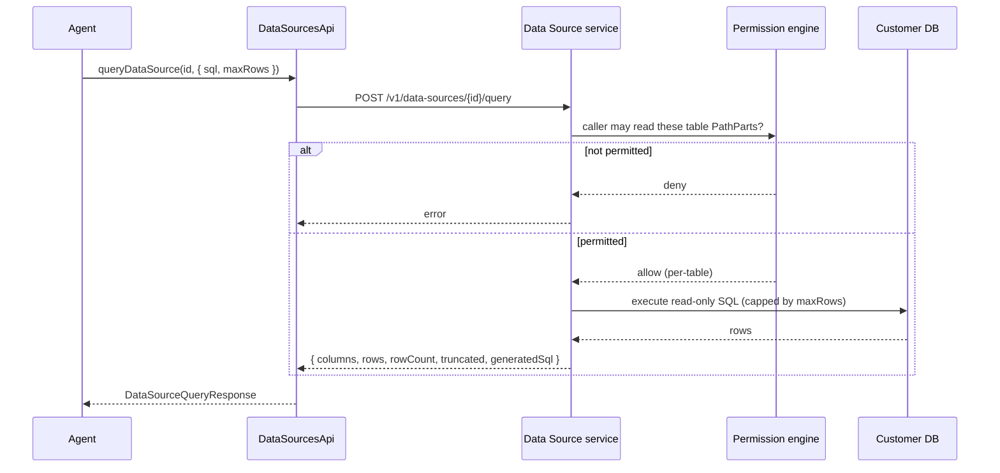
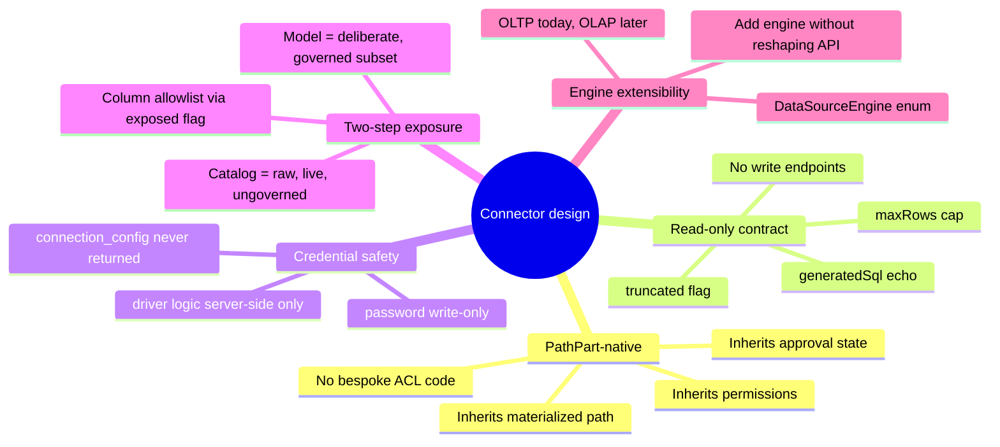

# Data Source Connectors — Design & Implementation

> Status: Living document · Scope: `DataSourcesApi` and the data-source models in `@knowledge-stack/ksapi`

This document explains how the database connector feature is built, the
decisions behind the implementation, and why the abstraction looks the way it
does. It is written so that anyone touching the connector surface can
understand the model without reading the generated client end-to-end.

---

## 1. What a "connector" actually is

A connector (a **Data Source**) is a registered, credentialed link to an
external SQL database that lives in the customer's own infrastructure. The
product never copies the customer's data into our store. Instead, a connector
is a thin, governed pointer: it holds connection parameters, exposes a
catalog of tables for an admin to *model*, and answers **read-only** SQL
queries on demand — each one gated by the same permission system that governs
every other object in the workspace.

The design goal is one sentence: **let an agent (or a user) ask questions of a
live operational database, safely, without us becoming the database.**

Three properties fall out of that goal and drive every decision below:

1. **Read-only by contract.** Queries are described as "a read-only SQL query
   the caller (or agent) wrote." There is no write path through a connector.
2. **Governed at the table and column level.** A raw database has hundreds of
   tables; we surface only the ones an admin deliberately *models*, and within
   those only the columns marked `exposed`.
3. **Credentials in, never out.** `password` on the connection config is
   write-only and is never serialized back in any response.

---

## 2. Why these engines — and why not ClickHouse

Today the `DataSourceEngine` enum supports exactly two engines:

```ts
export const DataSourceEngine = {
  Mysql:      'MYSQL',
  Postgresql: 'POSTGRESQL',
} as const;
```

These are the two most common **OLTP** (transactional, row-oriented) databases
backing the operational systems our customers already run — CRMs, billing
systems, app databases, internal tools. The connector feature is fundamentally
about pointing an agent at *the database the business already has*, so the
first two engines we support are the two we encounter most often.

### Why ClickHouse was not included

ClickHouse is an excellent database, but it solves a different problem than the
one this feature targets. The decision not to add it (yet) comes down to four
points:

| Consideration | MySQL / PostgreSQL | ClickHouse |
|---|---|---|
| **Workload class** | OLTP — the live operational systems agents need to read | OLAP — a columnar analytics warehouse, usually a *derived* copy of the OLTP data |
| **Where the questions live** | "What's this customer's current plan / order / status?" lives here | Aggregate analytics; rarely the source of truth an agent reasons over per-request |
| **Catalog & type semantics** | Standard `information_schema`, PK metadata, and types map cleanly onto our catalog model | Engine-specific types (`LowCardinality`, `Nullable`, materialized views, sharded/distributed tables) need bespoke introspection and don't fit the current catalog shape |
| **Access pattern fit** | Single-row and small-result lookups under a `maxRows` cap suit our query contract | ClickHouse is optimized for large scans/aggregations; our per-query row cap and read-one-table modeling work against its strengths |

In short: **ClickHouse is an analytics engine, and the connector feature is an
operational-data feature.** Adding it would mean introducing analytics-shaped
semantics (large aggregations, columnar types, distributed-table awareness)
into an abstraction that was deliberately kept small and OLTP-shaped. The
abstraction is engine-extensible by design (see §6), so ClickHouse — or
Snowflake, BigQuery, SQL Server, etc. — can be added later when there is a
concrete analytics use case that justifies the extra introspection and
query-planning surface. It was left out now to keep the first version focused
and the security model easy to reason about, not because of a technical
blocker.



---

## 3. System context

The TypeScript SDK is a generated client; it carries the *contract* of the
connector feature (models, endpoints, auth) but not the driver logic. The
actual connection handling, pooling, and query execution live behind the API in
the backend. The SDK's job is to present a typed, safe surface to that service.



Key boundary: **credentials and driver logic never reach the client.** The SDK
sends a `ConnectionConfig` *up* on create, but the connector responses it gets
back deliberately omit `connection_config` entirely.

---

## 4. Data model

A connector and its modeled tables are not standalone objects — they are
**PathParts**, the same governed, hierarchical node type that folders and
documents use. That is the single most important design choice in the feature:
by making a connector and each modeled table a node in the existing path tree,
they inherit the entire permission, approval, and materialized-path system for
free.



Notes that matter:

- **`ConnectionConfig` is input-only in practice.** It is supplied on
  `createDataSource`, but `DataSourceResponse` intentionally has no
  `connectionConfig` field — the password is write-only and never serialized
  back.
- **`ColumnConfig.exposed` is the column-level gate.** Only exposed columns are
  surfaced to the agent, even for a modeled table.
- **`tableName` vs `name`.** `tableName` is the physical table in the customer
  DB; `name` is the display label inside the workspace. The two are decoupled
  so an admin can rename without touching the source.

---

## 5. Lifecycle & flows

The feature is a small, deliberate state machine. There are five meaningful
operations, and they compose in a fixed order: **connect → introspect →
model → (govern) → query.**



### 5.1 Create — connect, with a test up front

`createDataSource` tests the connection *before* persisting. A connector that
can't be reached never enters the tree, so downstream operations can assume a
live target. This is why the create handler is documented as "create a
connector under a writable folder; **test the connection first**."

### 5.2 Catalog — live introspection

`getDataSourceCatalog` introspects the external database *live* and returns the
available tables and their columns (`CatalogTableResponse` /
`CatalogColumnResponse`, including `isPk`). This is intentionally **not**
persisted: the catalog is the raw, ungoverned truth of the database at this
moment, used only so an admin can pick what to model. Nothing in the catalog is
queryable until it is modeled.

### 5.3 Model — turn a table into a governed object

`modelDataSourceTable` promotes one physical table into a
`DataSourceTableResponse` — a child PathPart of the connector. It
auto-introspects the columns so the admin starts from the real schema, then
that table becomes a permissionable, queryable node.

### 5.4 Govern — field-level modeling

`updateDataSourceTable` is the field-modeling step: set a human description and
edit the `columnConfig` allowlist (`exposed` flags, comments). This is where a
table is shaped for agent consumption — hiding PII columns, annotating cryptic
column names, etc.

### 5.5 Query — read-only, doubly gated



The query path has **two independent gates**:

1. **Per-table path permissions** — the query is "gated by per-table path
   permissions," so a caller can only touch tables they're allowed to read, via
   the same engine that governs folders and documents.
2. **Shape limits** — `maxRows` caps the result, and the response carries a
   `truncated` flag plus `generatedSql` so the caller can see exactly what ran.

`generatedSql` echoing the executed SQL is a transparency/audit feature: the
caller (or a reviewer reading logs) can always reconstruct what hit the
database.

---

## 6. Why the abstraction is shaped this way



- **Why PathPart-native?** Reusing the path tree means connectors and tables get
  permissions, approval workflow (`approvalState`), tenancy (`tenantId`), and
  hierarchical addressing (`materializedPath`) without a parallel ACL system.
  A modeled table is governed exactly like a document.
- **Why a separate catalog step?** Introspection is cheap and live, but exposing
  every table by default would be unsafe. Splitting "what exists" (catalog)
  from "what's queryable" (modeled tables) makes exposure an explicit,
  auditable admin action.
- **Why echo `generatedSql` and cap `maxRows`?** Because the caller can be an
  agent. Bounding result size and recording the exact SQL keeps an
  autonomous query path observable and safe.
- **Why an `engine` enum instead of per-engine endpoints?** The contract is
  identical across engines — connect, introspect, model, query. Keeping the
  engine as a single discriminator means a new engine is an enum addition plus
  a backend driver, not a new API surface. This is exactly the seam through
  which ClickHouse or a warehouse could enter later (§2).

---

## 7. Surface summary

| Operation | Method & path | Purpose |
|---|---|---|
| `createDataSource` | `POST /v1/data-sources` | Create a connector under a writable folder; test the connection first |
| `getDataSource` | `GET /v1/data-sources/{id}` | Describe a connector + the modeled tables the caller can read |
| `getDataSourceCatalog` | `GET /v1/data-sources/{id}/catalog` | Live-introspect the external DB so an admin can pick tables to model |
| `modelDataSourceTable` | `POST /v1/data-sources/{id}/tables` | Model a table as a queryable child PathPart; auto-introspect columns |
| `updateDataSourceTable` | `PATCH /v1/data-sources/{id}/tables/{tableId}` | Field-modeling: update description / column allowlist |
| `queryDataSource` | `POST /v1/data-sources/{id}/query` | Run a read-only SQL query, gated by per-table path permissions |
| `testDataSourceConnection` | `POST /v1/data-sources/{id}/test` | Re-test a saved connector's connection |

---

## 8. Open questions / future work

- **Additional engines.** SQL Server and a warehouse engine (Snowflake /
  BigQuery / ClickHouse) are natural extensions once an analytics-shaped use
  case justifies the extra introspection and query semantics.
- **Result streaming.** The current contract returns a single bounded result
  (`maxRows` + `truncated`). Large analytical results would need a paging or
  streaming contract — another reason analytics engines are deferred.
- **Query cost controls.** `maxRows` bounds rows but not scan cost; per-engine
  statement timeouts / cost limits are a likely next safeguard as engines with
  heavier scan profiles are added.
